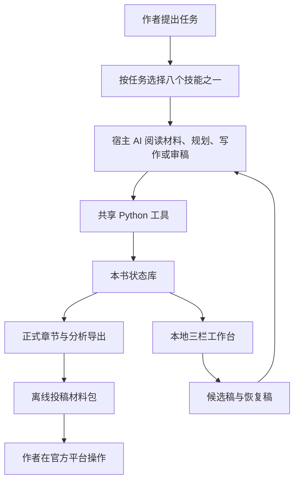

# Story Skill 当前工程全貌

核对日期：2026-09-26。本说明覆盖当前源码、本机安装、书籍文件、八个技能、共享工具、工作台、测试和发布；包含本日合并的商业连载规则。它是工程说明，不是对全部代码逐行审计，也不是文学质量保证。

## 1. 当前版本与三份副本

| 对象 | 当前状态 |
| --- | --- |
| 开发仓库与GitHub | v0.6.3功能和测试修复已推送；发布固定提交为 `03dd637ea03f62560b89e5f9030267b06c041e56`，后续main补录分发文档 |
| 最新公开Release | v0.6.3，八技能、39文件，附件已回下载核验 |
| GitHub Packages | `@ningcui29/story-skill@0.6.3`已发布、认证回下载并独立核对内容 |
| 本机技能 | 本次发布没有更换用户级安装；此前运行时仍标0.6.2并包含工作台开发更新，不能据版本号认定等于旧Release |

公开ZIP为232960字节，SHA-256 `8bbe8ebbf715cb7dcc7e0a4c8b840d0bdd9a2091fdb817461c509c62ace6ea8c`。固定标签隔离安装与附件逐文件一致。升级现有本机安装仍按[INSTALL.md](../INSTALL.md)核对并备份。

[本版分发记录](releases/v0.6.3.md)列出当前源码、CI、附件、安装和包的证据。本文后续源码规模、命令清单及历史测量均保留各自编写时范围，不把旧快照改称本版实测。

## 2. 产品怎样工作

写作、理解和文学判断由宿主 AI 完成。Story Skill 提供按任务加载的指令、中文写作指导、可恢复的本地状态工具，以及浏览器工作台。共享 Python 运行时不调用模型 API，不自行生成小说，也没有内置持续后台创作循环。



默认当前会话完成工作。只有用户或适用规则明确要求、且宿主允许时才分派独立代理。自审、独立复核与盲评分别记录，不能混称。

## 3. 八个技能各做什么

| 入口 | 主要职责 | 完成边界 |
| --- | --- | --- |
| [story-skill](../skills/story-skill/SKILL.md) | 总入口、共享约束、目录与工作台 | 选择本次流程，不默认加载所有材料 |
| [plan](../skills/story-skill-plan/SKILL.md) | 开书、设定、总纲、分卷、细纲、平台分类、旧作接入 | 规划任务完成后不自动写正文 |
| [write](../skills/story-skill-write/SKILL.md) | 独立试写、章中续写、整章、多章与短篇完本 | 按授权区分候选和正式保存 |
| [review](../skills/story-skill-review/SKILL.md) | 审稿、润色、排版、外改核对、历史修订 | 纯审查不改稿，候选不自动采用 |
| [analyze](../skills/story-skill-analyze/SKILL.md) | 开篇点评、深读、全量证据分析、报告修订与续跑 | 原文覆盖与判断证据必须可说明 |
| [research](../skills/story-skill-research/SKILL.md) | 榜单、市场与事实查询 | 标明来源、日期、样本及推断 |
| [cover](../skills/story-skill-cover/SKILL.md) | 封面构思、生成、编辑及检查 | 依赖宿主图像能力；提示词不算图片交付 |
| [publish](../skills/story-skill-publish/SKILL.md) | 冻结正式章、离线包与作者副本核对 | 当前不自动登录、上传、提交或定时发布小说 |

## 4. 当前写作规则

共同方向是人物目标、选择、行动、有效回应和后果。阻力须实际改变行动，关键过程不能只用“经过努力”跳过；读者期待须在具体情节中得到回报。人物知情、时间、位置、关系、伤势和资源前后一致。工具卡片和核对记录不充当剧情来源，正文不为可信而展示完整账目或手续。

本日新增的[商业连载专项](../skills/story-skill-write/references/drama.md#番茄与七猫商业连载)在番茄、七猫商业网文及明确的网文化任务中启用：开头前 100—300 字建立目标、异常或其他有效牵挂；中途章按承接、入事、升级、部分回报、新问题、钩子展开；重点爽点有阻力、期待、出手、结果及反馈；悬疑反转有可追踪线索。全书终章仍需兑现与收束。

商业段落通常 1—3 句，重点信息可独立成段，实际手机阅读避免持续密集；屏幕行数取决于字号和栏宽，不将它换成固定字符上限。保留有作用的内心、日常和环境，压缩重复解释与无效流程，不靠频繁身体小动作装作有剧情。商业规则是用户采用的创作要求，不是平台官方审核标准。

当前正文格式：必要章名和正文、无 Markdown 排版标记、段间空一行、不手工缩进。换人发言默认换段，紧密动作与短对白可同段；直接对白外双内单引号，同一对外双引号中的中文句号至多一次且只用于收束。省略号“……”，破折号现改为规范使用“——”；旧的全局禁用默认已撤销，明确的本书例外仍按约定处理。编号、负数、网址等专用符号保留。只做排版时不修改字词、标点或事实。

语言与文学判断靠通读。工具不会自动判断全部病句、对白语义、原创性或吸引力，没有可信的“AI 率”检测器。[完整写作规则与可复制任务模板](../skills/story-skill-write/references/drama.md)。

## 5. 一部小说的完整路径

从拆书开始：确认原文与覆盖范围 → 在独立分析目录提炼机制和证据 → 把可迁移方法及失效条件写进原创策划 → 重新建立人物、事件链与解决方法。参考剧情不变成本书已发生的事实。

新开长篇：确定书名和书根 → 创作约定 → 定位、人物、全书走向和分卷粗纲 → 当前卷与近期逐章细纲 → 同步工具章计划。只展开当前授权范围，不为了目录完整预写全部章节。短篇可以用一份等效规划，先明确关键选择与结局。

正式写章：读取当前约定、状态、可读细纲和必要前文 → 获取本章上下文 → 写草稿 → 实测篇幅 → 生成绑定该稿件的审查骨架 → 完成因果、连续性、约束、读感四项语义审查及原句证据 → 提交 → 回读实际导出。只有真实变更写入状态，导出失败须恢复后才算交付。

独立片段不初始化书库；书内候选独立保存，不因试写改变已采用计划或正式状态。章中续写不重复前文、不擅自建下一章。多章任务逐章保存直到授权范围完成。

## 6. 文件目录与数据归属

```text
写作父目录/
├── 作品分析/参考书名/              参考材料与拆书报告
└── 本书书名/                      --book 指向这里
    ├── 创作约定.md                当前要求、阶段和断点
    ├── 00_项目策划/               按需建立
    ├── 01_大纲细纲/
    │   ├── 全书总纲.md
    │   ├── 第一卷 卷名/
    │   │   ├── 本卷大纲.md
    │   │   └── 第1章 章节名.md    此处是细纲
    │   └── 99_历史版本/
    ├── chapters/第一卷 卷名/
    │   └── 第1章 章节名.md        正式正文的可读导出
    ├── 04_封面/                   按需保存实际图片
    ├── 本书书名.txt               短篇完本全文
    └── .story/
        ├── state.sqlite3         创作状态与托管正文
        ├── drafts/               草稿与候选
        ├── analysis/             可恢复分析及报告
        ├── workbench/            派生页面与备份
        ├── publishing.sqlite3    独立的本地投稿准备记录
        └── publishing-exports/   ZIP 与包外回执
```

这是默认布局，不要求生成空目录，也不自动搬迁已有等效布局。卷目录必须带卷序号和卷名，章文件名为 `第N章 章节名称.md`，章号不补零。`--title` 登记书名，不替 `--book` 自动再建一层目录。工具按登记的真实路径读取旧章。

正式状态在数据库中，`chapters/` 是可读导出。直接改导出文件会成为需要核对的外改，不能靠下一次导出强盖。可读大纲与工具章计划是两份不同用途的材料，修改已采用细纲须同步计划。备份整书目录才能保留续写、历史和分析能力，只复制正文不等于完整书库备份。[详细目录规范](目录结构.md)。

## 7. 状态、证据与上下文

核心数据库 schema 为 2。主要记录书籍身份、递增修改版本、人物/事实/世界/伏笔/偏好/约束卡、章计划、正文、审查收据、事件和分析来源。内容对象以 SHA-256 绑定，正式章节与派生产物引用这些对象。事件版本是工具保存顺序，不等同于故事时间。

`context` 按本章计划、必要卡片、到期承诺、近期衔接生成有预算的上下文。预算按 UTF-8 字节，不是模型 token；被省略的材料不能假称已读。摘要用于定位，关键语义疑点仍回读原文。`recall` 等提供受限的文字检索，不是向量记忆或任意全库自动推理。

`book_id` 用来区分书，`revision` 防止旧状态覆盖新状态，`sha256` 绑定具体文本。它们保护版本与材料对应关系，不证明语义判断正确。操作锁由系统管理；正文、审查及状态写入同一数据库事务，文件导出在其后恢复。导出异常时保留已提交数据和冲突现场。

需要多卷、多视角或长距伏笔时，可另外使用实体、别名、事实、知情、规则、伏笔、资源转移和故事线记录。只保存正文有依据的实际变化，不能为了填表额外编情节。[超长篇状态](../skills/story-skill-write/references/long-form.md)。

## 8. 修改旧章与恢复

最新正式章的修订使用对应的替换流程；外改先核对来源和正式基线。较早章节修改使用历史分支，记录受影响后文、候选、依赖证据和审查决定。旧候选可保留作材料，但版本或依赖变动后不能只改哈希跳过复核。

历史发布的作用是在本书中采用已审查修订，不是向七猫或番茄发文。恢复、迁移、正式采用和平台发布是不同操作。旧 schema 升级显式执行，并保留一致性备份；不删库重建来绕过错误，也不让新旧工具同时写同一本书。[历史修订](../skills/story-skill-review/references/history.md) · [恢复说明](recovery.md)。

## 9. 拆书、分类和完本

局部点评或一轮可完成的短文分析可以直接交付；需要跨轮恢复时，保存原文快照、分块、覆盖和逐块发现。保留序章、番外及特殊标题，核心结论要有可定位引文、解释与反例核对。所有已导入块完成只证明导入范围完成，不证明原书没有缺章。

已定稿分析报告保持原稿，修订另存并留进度，不能删除旧报告冒充正常更新。拆书方法可迁移，独特人物、事件链、表达和具体解法不能简单换名复制。[深读规范](../skills/story-skill-analyze/references/deep-reading.md)。

长短篇总纲都记录篇幅类型、目标平台、实际栏目、拟选分类、正文依据、来源日期和确认状态。番茄长篇按阅读标签/内容标签，短篇按主分类、情节、角色、情绪、背景；七猫按其对应页面核对，不混用两平台选项。截图词表不是永久有效的官方全集。[番茄标签表](../skills/story-skill-plan/references/fanqie-tags.md)。

短篇完本须核对全文收束、总纲分类，合并所有已提交章为书名命名的 TXT，再交实际封面。后续正式修订刷新已登记全文；封面没有可生成能力时应报告未完成。长篇完本同样审查主要承诺和结局后果，但当前没有与短篇完全相同的首次全文合并要求。

## 10. 工作台：浏览、候选与恢复

同日后续开发新增按章关联、当前进度、字数核对、大纲排版、差异高亮、审稿任务、全文搜索和登记多书切换。更新后的功能与验收见[新版服务界面](本地工作台分析.md#按章节工作的新版服务界面)；本文此前的源码行数与验证快照不代表这轮新改动。

当前是目录、正文、状态/对照三栏。正式章节可分页和搜索；本地服务可发现草稿、候选、分析、编号创作目录及书根文本和支持的图片。正式稿、候选和未登记材料有不同身份，文件存在不等于已采用。

编辑区隐藏匹配的开头章名，保存时保留原前缀；修改另存新候选与来源记录，不覆盖正式正文。候选可以重开编辑，支持并排正式稿对照，尚不是逐行差异编辑器。状态卡、结构化世界、完整历史及发布明细仍通过原命令读取。

停止输入后自动恢复写入本书文件；正文和来源都核对上次校验值。外部变化或不完整写入会另存恢复稿、保留旧稿。保存先落完整待核对记录，再写正文与来源，进程中断后能找回已经落盘的内容；它不是两个文件的原子事务，不保证尚未落盘输入或磁盘损坏后的恢复。

服务仅监听 `127.0.0.1`，使用随机地址令牌及请求来源检查；同一本书以系统锁限制一份新服务。先 `workbench-status` 查看并复用，升级前保存所有页面编辑，再 `workbench-stop --saved`。停止命令不会替浏览器自动保存。旧版未登记进程需单独核对，不按模糊名称批量结束进程。

静态 HTML 只读，服务版才有编辑。文件大小、路径、符号链接、来源记录和外改均有检查。完整候选文件上限 1 MiB；这属于工程边界，不是小说建议篇幅。工作台不联网抓取或代发小说。[工作台详细行为与修复记录](本地工作台分析.md)。

## 11. 投稿准备与软件发布

小说投稿准备：选择已审查正式章节和明确平台目标 → 冻结本地清单 → 核对正式版本 → 导出 ZIP 与包外回执 → 再核对包及当前正文 → 作者自行在官方后台操作。ZIP 含使用说明、目录、清单，以及逐章标题、正文、作者的话；作者的话只是本地候选字段，后台是否有对应栏须实际核对。

作者提供后台文字副本后，可与冻结稿比较并保存本地比较摘要。相同文字不证明平台已保存，清单取消也不取消线上稿件。已过期包不因后来内容相同自动恢复可用。[完整能力边界](platform-publishing.md)。

软件发布另走 GitHub：源码测试、打包、固定标签、Release 附件、附件回下载及隔离安装、Packages 包装与回下载核验。npm 包发布到 GitHub 注册表，作为技能文件的分发包装；仓库根没有 Node 应用式 `package.json`，并不缺失一个网页应用构建工程。

## 12. 技术结构与依赖

核心运行时由七个 Python 文件构成，共 8539 行（本次快照，含空行和内嵌页面代码）：

| 模块 | 行数 | 职责 |
| --- | ---: | --- |
| [story.py](../skills/story-skill/scripts/story.py) | 2449 | CLI 路由、章计划、计数、正文提交、导出、分析等核心流程 |
| [story_storage.py](../skills/story-skill/scripts/story_storage.py) | 193 | schema、内容对象、事务辅助及系统锁 |
| [story_search.py](../skills/story-skill/scripts/story_search.py) | 292 | 本地索引与受限文字检索 |
| [story_world.py](../skills/story-skill/scripts/story_world.py) | 912 | 实体、世界规则、知情、伏笔和资源记录 |
| [story_history.py](../skills/story-skill/scripts/story_history.py) | 1203 | 历史版本、依赖、分支、失效和采用 |
| [story_publish.py](../skills/story-skill/scripts/story_publish.py) | 1679 | 独立投稿准备数据库 schema 1、离线包与副本核对 |
| [story_workbench.py](../skills/story-skill/scripts/story_workbench.py) | 1811 | 页面生成、文件浏览、候选编辑、本机服务与恢复 |

文档要求 Python 3.10+，运行时使用标准库及 SQLite；浏览器执行页面内 JavaScript。可选 token 基准依赖 `tiktoken==0.14.0`。部分交互回归依赖 Node 环境，不能把缺少该环境时的跳过称为通过。图像、网页访问和模型能力由宿主提供，不属于 Python 工具自带服务。

根目录 `scripts/` 有 12 个维护脚本，覆盖打包、项目安装、发布核验、Packages 包装/同步、冒烟、中文合成事务检查、超长篇回放、容量、基准、迁移及升级探测。`tests/` 当前 63 个测试模块。`benchmarks/` 保留容量/用量与文学试用材料，旧 `examples/` 已移出 Git 跟踪，原文仅留本地备份，`dist/` 是构建产物；真实小说不存进技能源码或安装目录。工程采用 MIT 许可证，具体以 [LICENSE](../LICENSE) 为准。

## 13. 验证到哪里

| 证据 | 结论与范围 |
| --- | --- |
| 已发布 0.6.2 | 发布文档记载本地 746 项，729 通过、17 跳过；对应 Linux/Windows CI 通过 |
| 材料类型与目录稳定性修复 | 本机全量794项，777通过、17跳过；工作台88项。验收见[记录](../benchmarks/results/workbench-material-navigation-2026-09-26/assessment.md)，未新跑Windows CI |
| 按章工作流开发更新 | 本机全量788项，771通过、17跳过；工作台82项。验收见[记录](../benchmarks/results/workbench-flow-2026-09-26/assessment.md)，未新跑Windows CI |
| 此前工作台开发版 | 归档本机全量日志 778 项，761 通过、17 跳过；专项 72 项，未新跑 Windows CI |
| 前轮章计划与入口修复 | 45 项相关测试与入口校验通过；三章试写 4635 字并独立评阅，保留时间歧义与风格建议 |
| 本轮商业规则合并 | 三个修改入口格式校验、10 项相关回归和39文件构建通过；未进行新小说生成或新文学盲评 |
| 本次工程说明 | 读取源码、安装逐文件比较、CLI参数导出、历史测试日志及远端状态；没有重新执行全量回归 |

前三章测试小说及其原始评阅已移出当前仓库，不能仅凭保留的范围说明复现文学结论，也不能用它证明本次商业规则有效。模型评阅不是人类反馈，容量测试不是百万字小说质量证据，平台标签核对不是推荐或审核通过。工作台历史修复有隔离浏览器实测，但尚无本轮真实 Windows 桌面人工验收。

## 14. 当前限制与维护重点

目前最明显的维护问题是同号开发版与发布版容易混淆；应以提交和文件哈希区分。工程文档包含较多历史阶段描述，例如目录文档中仍有早期版本示例，本说明以本日源码和安装核对为准；本轮没有把历史页面全部改写或声称全部文档一致。

工作台仍以浏览和候选编辑为主，正式采用需要审稿流程。平台自动上传尚未实现。语义正确性、原创距离、人物吸引力和长期追读依赖真实读稿，工具不会给出确定保证。整章语义检查仍可能漏掉时间歧义等问题，因此需要保留证据和后续修订能力。

完整机器清单保留在 [本次工程盘点目录](../benchmarks/results/project-overview-2026-09-26/engineering-inventory.json)：包含源文件校验、测试模块、维护脚本、数据库对象声明和远端核对范围。下方附录从当前实际 CLI 自动导出，供排障和进一步逐项阅读使用。

## 附录：61 个命令及逐文件入口

完整参数、必填项、默认值和可选值见 [commands.json](../benchmarks/results/project-overview-2026-09-26/commands.json)，命令帮助见 [cli-help.txt](../benchmarks/results/project-overview-2026-09-26/cli-help.txt)。命令名中的 publish 要结合 history 或平台准备前缀辨别，不能直接理解为发到平台。

| 分组 | 当前命令 |
| --- | --- |
| 基础与恢复 | `template`、`init`、`status`、`migrate`、`audit`、`export` |
| 规划与上下文 | `notes`、`plan`、`context`、`recall`、`chapter-read`、`dependencies` |
| 正文与接入 | `lint`、`prepare`、`commit`、`reconcile`、`adopt`、`adopt-backfill`、`assemble-short` |
| 拆书分析 | `ingest`、`sources`、`coverage`、`next`、`record`、`findings`、`source-read`、`report` |
| 世界状态 | `world-save`、`world-check`、`world-read` |
| 历史与缓存 | `cache-get`、`cache-put`、`history-dependencies`、`history-deps`、`history-inspect`、`history-publish`、`history-refresh`、`history-saved`、`history-snapshot`、`history-start`、`history-state`、`history-update` |
| 本地投稿准备 | `publish-backup`、`publish-cancel`、`publish-check`、`publish-compare`、`publish-compare-history`、`publish-compare-inspect`、`publish-compare-record`、`publish-export`、`publish-export-list`、`publish-inspect`、`publish-list`、`publish-prepare`、`publish-recover`、`publish-verify-export` |
| 工作台 | `workbench-snapshot`、`workbench-export`、`workbench-serve`、`workbench-status`、`workbench-stop` |

下表列出全部 39 个分发文件；行数仅供定位和规模理解，不是质量指标。安装字节比较结果全部一致。

| 文件 | 行数 | 与发布标签一致 |
| --- | ---: | --- |
| [story-skill/LICENSE](../skills/story-skill/LICENSE) | 21 | 是 |
| [story-skill/SKILL.md](../skills/story-skill/SKILL.md) | 50 | 否，本地开发更新 |
| [story-skill/agents/openai.yaml](../skills/story-skill/agents/openai.yaml) | 6 | 是 |
| [story-skill/references/project-state.md](../skills/story-skill/references/project-state.md) | 87 | 是 |
| [story-skill/scripts/story.py](../skills/story-skill/scripts/story.py) | 2449 | 否，本地开发更新 |
| [story-skill/scripts/story_history.py](../skills/story-skill/scripts/story_history.py) | 1203 | 是 |
| [story-skill/scripts/story_publish.py](../skills/story-skill/scripts/story_publish.py) | 1679 | 是 |
| [story-skill/scripts/story_search.py](../skills/story-skill/scripts/story_search.py) | 292 | 是 |
| [story-skill/scripts/story_storage.py](../skills/story-skill/scripts/story_storage.py) | 193 | 是 |
| [story-skill/scripts/story_workbench.py](../skills/story-skill/scripts/story_workbench.py) | 1811 | 否，本地开发更新 |
| [story-skill/scripts/story_world.py](../skills/story-skill/scripts/story_world.py) | 912 | 是 |
| [story-skill-analyze/LICENSE](../skills/story-skill-analyze/LICENSE) | 21 | 是 |
| [story-skill-analyze/SKILL.md](../skills/story-skill-analyze/SKILL.md) | 54 | 是 |
| [story-skill-analyze/agents/openai.yaml](../skills/story-skill-analyze/agents/openai.yaml) | 6 | 是 |
| [story-skill-analyze/references/deep-reading.md](../skills/story-skill-analyze/references/deep-reading.md) | 52 | 是 |
| [story-skill-analyze/references/examples.md](../skills/story-skill-analyze/references/examples.md) | 79 | 是 |
| [story-skill-cover/LICENSE](../skills/story-skill-cover/LICENSE) | 21 | 是 |
| [story-skill-cover/SKILL.md](../skills/story-skill-cover/SKILL.md) | 15 | 是 |
| [story-skill-cover/agents/openai.yaml](../skills/story-skill-cover/agents/openai.yaml) | 6 | 是 |
| [story-skill-plan/LICENSE](../skills/story-skill-plan/LICENSE) | 21 | 是 |
| [story-skill-plan/SKILL.md](../skills/story-skill-plan/SKILL.md) | 32 | 否，本地开发更新 |
| [story-skill-plan/agents/openai.yaml](../skills/story-skill-plan/agents/openai.yaml) | 6 | 是 |
| [story-skill-plan/references/fanqie-tags.md](../skills/story-skill-plan/references/fanqie-tags.md) | 258 | 是 |
| [story-skill-publish/LICENSE](../skills/story-skill-publish/LICENSE) | 21 | 是 |
| [story-skill-publish/SKILL.md](../skills/story-skill-publish/SKILL.md) | 49 | 是 |
| [story-skill-publish/agents/openai.yaml](../skills/story-skill-publish/agents/openai.yaml) | 4 | 是 |
| [story-skill-research/LICENSE](../skills/story-skill-research/LICENSE) | 21 | 是 |
| [story-skill-research/SKILL.md](../skills/story-skill-research/SKILL.md) | 14 | 是 |
| [story-skill-research/agents/openai.yaml](../skills/story-skill-research/agents/openai.yaml) | 6 | 是 |
| [story-skill-review/LICENSE](../skills/story-skill-review/LICENSE) | 21 | 是 |
| [story-skill-review/SKILL.md](../skills/story-skill-review/SKILL.md) | 62 | 否，本地开发更新 |
| [story-skill-review/agents/openai.yaml](../skills/story-skill-review/agents/openai.yaml) | 6 | 是 |
| [story-skill-review/references/history.md](../skills/story-skill-review/references/history.md) | 64 | 是 |
| [story-skill-write/LICENSE](../skills/story-skill-write/LICENSE) | 21 | 是 |
| [story-skill-write/SKILL.md](../skills/story-skill-write/SKILL.md) | 26 | 否，本地开发更新 |
| [story-skill-write/agents/openai.yaml](../skills/story-skill-write/agents/openai.yaml) | 6 | 是 |
| [story-skill-write/references/chapter.md](../skills/story-skill-write/references/chapter.md) | 29 | 是 |
| [story-skill-write/references/drama.md](../skills/story-skill-write/references/drama.md) | 158 | 否，本地开发更新 |
| [story-skill-write/references/long-form.md](../skills/story-skill-write/references/long-form.md) | 56 | 是 |
